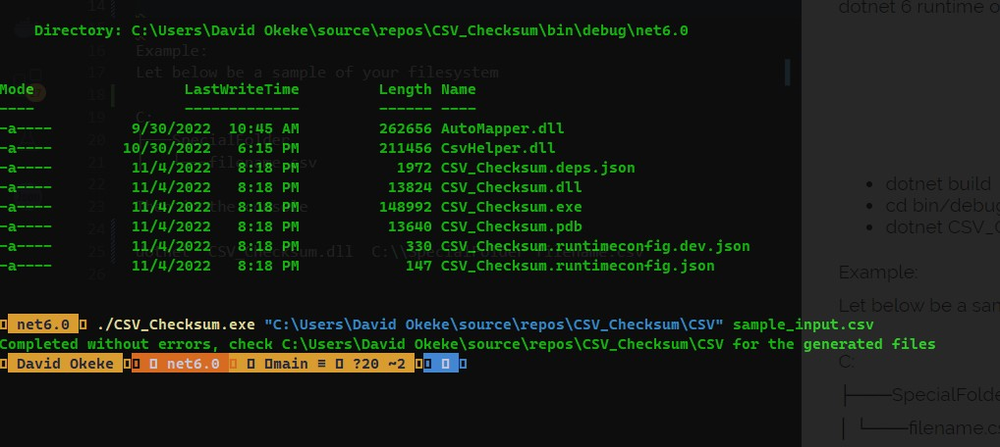

# How To Use
CSV_Checksum converts a csv file to CHIP-0007 compatible jsons, calcalutes the SHA-256 hash for each new json file, and then appends the hash value to the original csv. This is a .Net6 app.

## Requirement
dotnet 6 runtime on Windows

## How to use

- dotnet build
- cd bin/debug/net6.0
- ./CSV_Checksum.exe {AbsolutePathToFolder} {filename.csv}

